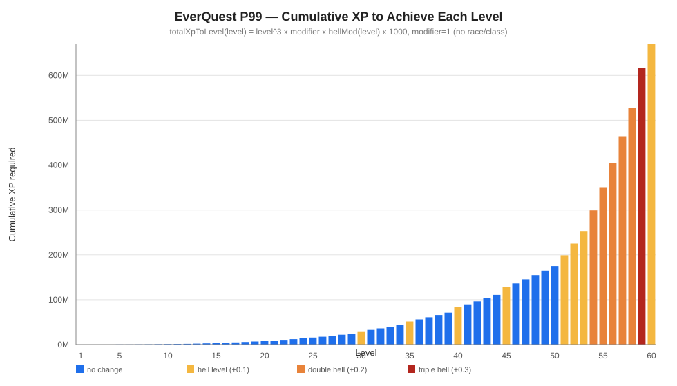
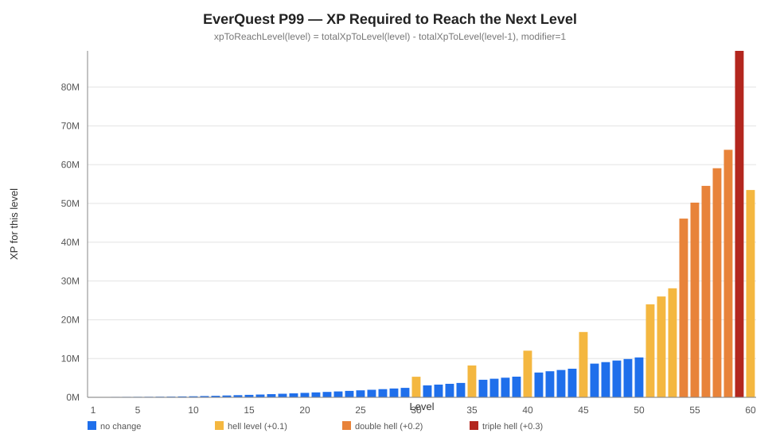
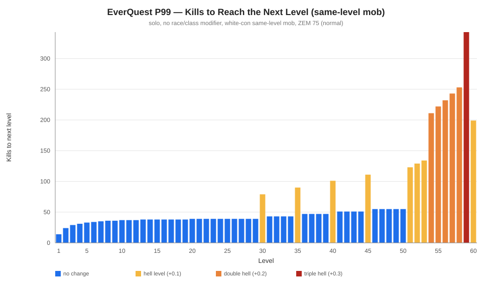
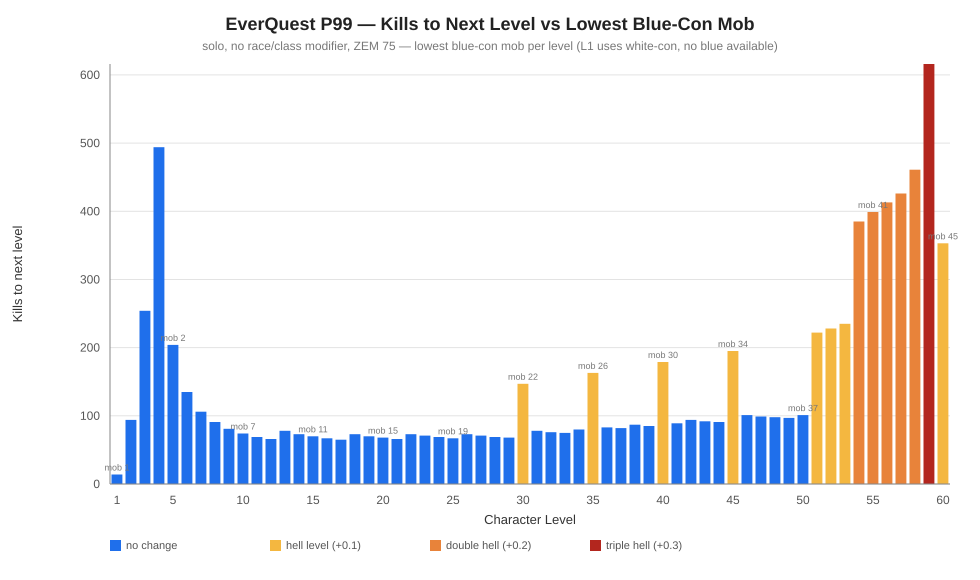

# EQ-XP-Calculator
This app helps you understand how many mobs you need to defeat per level and accounts for XP in groups.

## Disclaimer
Over the course of its life, Everquest has changed modifiers, hell levels, ZEM and xp to level. There are also several places where hard sources of truth do not exist, so assumptions must be made. As a result, any calculator can be at best an approximation and can't be correct for all eras. 

This calculator optimizes for the Project 1999 server, but should generally be applicable to TLPs during the classic era. Treat all results as approximate. Feel free to provide feedback and corrections to Gorrek at ajbtechinfo@gmail.com

EverQuest and the world map artwork are property of Daybreak Game Company. This is an unofficial fan project with no affiliation to Daybreak or the Project 1999 team.

## 1. XP per mob

The base XP a single mob is worth, before group, con, or cap adjustments:

```
baseMobXp = mobLevel^2 * ZEM
```

**Examples** (the ZEM is filled in once the zone is known — see section 2):

- *A Froglok* — a level 3 mob in **Innothule Swamp**:

  ```
  baseMobXp = 3^2 * ZEM
  ```

- *Lord Bob* — a level 65 mob in **Velk's Labyrinth** (Velketor's Labyrinth):

  ```
  baseMobXp = 65^2 * ZEM
  ```

These are the base values before the group bonus, consider modifier, and 11%
per-mob cap are applied (see sections below).

## 2. ZEM (Zone Experience Modifier)

`ZEM` is a per-zone multiplier where **75 = "normal"**. ZEM values have changed
over time and most published sources should be considered unreliable. This calculator
uses the ZEM based on the P99 wiki, but individual ZEM values can be entered as well
if a good source of truth is known.

ZEM values were intended to help balance the danger of various zones (typically
dungeons).

**Examples** (ZEM values from the community snapshot in `data/zems.json`):

- *A Froglok* in **Innothule Swamp** (ZEM 100):

  ```
  baseMobXp = 3^2 * 100 = 900
  ```

- *Lord Bob* in **Velk's Labyrinth** (Velketor's Labyrinth, ZEM 94):

  ```
  baseMobXp = 65^2 * 94 = 397,150
  ```

## 3. XP per level

The cumulative XP to reach a level follows a cubic curve:

```
totalXpToLevel(L) = L^3 * C * R * H * 1000
```

- `L` — the level being reached
- `C` — class modifier (see below)
- `R` — race modifier (see below)
- `H` — hell-level multiplier (see below)

The XP for a *single* level is the difference between two cumulative totals:

```
xpToReachLevel(L) = totalXpToLevel(L) - totalXpToLevel(L - 1)
```

The cumulative XP curve is dominated by hell-level multipliers at high levels. The jump at level 59 (triple hell) is especially dramatic — reaching level 60 requires more total XP than the entire journey from level 1 to 58 combined.



Between hell levels, each individual level costs only a modest amount more than the last — XP requirements rise smoothly with the cubic curve. Hell levels break that pattern abruptly: level 30 costs roughly 70% more than level 29, and the steps grow steeper through the 50s. The bar color indicates how much the hell multiplier changed at that level.



## 4. Number of mobs needed per level

Most sites report the amount of XP needed to level, but the more interesting view
is the number of mob kills needed to level. This is commonly understand to increase
exponentially, but excluding hell levels, this count changes relatively slowly and
incrementally.



The chart below shows the same kill count, but using the **lowest-level mob that still cons blue** to the character at each level. The number above each bar is the mob level used. Because blue-con mobs give full XP (modifier 1.0) yet require fewer kills than a same-level white-con mob, this represents the most efficient mob choice available at each level.

The spike at levels 2–4 occurs because at those levels the only blue-con mob available is level 1 — there are no lower-level mobs to fill the blue range. Level 1 mobs award very little XP (their base XP scales as `mobLevel² × ZEM = 1 × ZEM`), so an enormous number of kills is required. By level 5 the blue threshold has risen enough that mob level 2 becomes available, and kill counts drop sharply. Level 1 itself has no blue cons at all, so it uses a white-con mob instead and is noted accordingly.



## 5. Race / class modifiers

These are XP-**to-level** multipliers: a penalty (`> 1`) means you need *more*
XP to level; a bonus (`< 1`) means *less*. Race and class
multipliers are **multiplied together**, not added (e.g. a Troll SK = 1.2 race
× 1.4 class = 1.68).

**Race modifiers:**

| Race | Modifier |
|---|---|
| Troll | 1.20 (−20%) |
| Iksar | 1.20 (−20%) |
| Ogre | 1.15 (−15%) |
| Barbarian | 1.05 (−5%) |
| Halfling | 0.95 (+5%) |
| all others | 1.00 |

**Class modifiers.** During the earliest eras, specific classes 
had further penalties to help balance the fact that some classes would otherwise
level faster than others. Due to improved balancing, these modifiers were later
removed (Jan 14, 2001 Patch - Velious Era). 

| Class | Modifier |
|---|---|
| Paladin/SK/Ranger/Bard | 1.40 (−40%) |
| Monk | 1.20 (−20%) |
| Wizard/Mage/Enchanter/Necromancer | 1.10 (−10%) |
| Rogue | 0.91 (+9%) |
| Warrior | 0.90 (+10%) |
| all others | 1.00 |

The calculator allows the user to select whether or not class penalties are in
effect. Notably this selection also changes the method of how XP is split
within a group which took place in the same patch (see below).

## 6. Hell levels

"Hell levels" cost progressively more XP. `H` is a multiplier (`>= 1.0`) applied
to the XP **requirement** (item 1), not to per-kill gain:

| Level | H | 
|---|---|
| 1–29 | 1.0 |
| 30–34 | 1.1 | 
| 35–39 | 1.2 |
| 40–44 | 1.3 |
| 45–50 | 1.4 |
| 51 | 1.5 |
| 52 | 1.6 |
| 53 | 1.7 |
| 54 | 1.9 |
| 55 | 2.1 |
| 56 | 2.3 |
| 57 | 2.5 |
| 58 | 2.7 |
| 59 | 3.0 |
| 60 | 3.1 |

Levels where the modifier changes by 0.1, 0.2 and 0.3 are known as "Hell Levels",
"Double Hell Levels" and "Triple Hell Levels" colloquially. 

It is commonly believed that hell levels require double the experience of a
standard level. This is nearly true at mid levels, but the actual impact of 
a hell level is subtly different and actually worse at high levels.

The more precise explanation is that a hell level requires 10% more 
than the standard XP to level plus an additional 10% of all experience earned to 
date. The result is typically that the impact of hell levels gets higher as you 
level and your total amount of XP earned to date increases. 

As an example, level 30 requires 5.3M XP to hit level 31 and of that, 2.7M comes
from the fact that it is a hell level. Level 45 requires 16.8M XP, of which 9.1M
comes from the fact that it is a hell level.

| Lvl | Normal XP (w/ hell) | Hell mult | Extra XP from hell jump |
|----:|--------------------:|:---------:|------------------------:|
| 30 | 5,311,000 | x1.1 | 2,700,000 |
| 31 | 3,070,100 | x1.1 | 0 |
| 32 | 3,274,700 | x1.1 | 0 |
| 33 | 3,485,900 | x1.1 | 0 |
| 34 | 3,703,700 | x1.1 | 0 |
| 35 | 8,215,600 | x1.2 | 4,287,500 |
| 36 | 4,537,200 | x1.2 | 0 |
| 37 | 4,796,400 | x1.2 | 0 |
| 38 | 5,062,800 | x1.2 | 0 |
| 39 | 5,336,400 | x1.2 | 0 |
| 40 | 12,017,200 | x1.3 | 6,400,000 |
| 41 | 6,397,300 | x1.3 | 0 |
| 42 | 6,717,100 | x1.3 | 0 |
| 43 | 7,044,700 | x1.3 | 0 |
| 44 | 7,380,100 | x1.3 | 0 |
| 45 | 16,835,800 | x1.4 | 9,112,500 |
| 46 | 8,695,400 | x1.4 | 0 |
| 47 | 9,081,800 | x1.4 | 0 |
| 48 | 9,476,600 | x1.4 | 0 |
| 49 | 9,879,800 | x1.4 | 0 |
| 50 | 10,291,400 | x1.4 | 0 |
| 51 | 23,976,500 | x1.5 | 13,265,100 |
| 52 | 25,996,300 | x1.6 | 14,060,800 |
| 53 | 28,118,100 | x1.7 | 14,887,700 |
| 54 | 46,090,700 | x1.9 | 31,492,800 |
| 55 | 50,205,900 | x2.1 | 33,275,000 |
| 56 | 54,529,300 | x2.3 | 35,123,200 |
| 57 | 59,065,700 | x2.5 | 37,038,600 |
| 58 | 63,819,900 | x2.7 | 39,022,400 |
| 59 | 89,334,600 | x3.0 | 61,613,700 |
| 60 | 53,463,000 | x3.1 | 21,600,000 |


## 7. Max XP

The Max XP from a single mob has also changed over the course of the EQ timeline.
This calculator uses a max
of 11% which is what is currently believed to be implemented on P99. This typically
comes into play when low level characters being powerleveled kill a higher level mob.
Excess XP above the cap is simply lost, not redistributed within a group. 

## 8. Consider Modifier

The amount of XP per mob is modified by the mobs "consider" color. Similar to other 
categories this has changed over time with "light blue" added in Luclin to 
differentiate the various results from Green text. This calculator uses the
"consider" colors from P99.

| Con Color | Modifier | 
|---|---|
| Red, Yellow, White, Blue | 1.0 |
| Green (text dependent) | 0, 0.25, 0.5 | 

There is not a good source of truth on "consider" results based on level. The P99 wiki
has multiple conflicting sources, but the following table is used as source of truth here.
"Consider" level ranges with only one green text result in a 0 modifier. Those with two
result in 0 and 0.5. Those with three result in 0, 0.25, 0.5.

In the table below, "Level Diff" is the mob's level relative to yours.

| Char Level | Level Diff | Color | Modifier | Message |
|---|---|---|---|---|
| **1–6** | −4 and below | Green | 0 | looks like a reasonably safe opponent |
| | −1 to −3 | Blue | 1.0 | looks like you would have the upper hand |
| | 0 | White | 1.0 | looks like an even fight |
| | +1 and +2 | Yellow | 1.0 | looks like quite a gamble |
| | +3 or more | Red | 1.0 | what would you like your tombstone to say? |
| **7–8** | −4 and below | Green | 0 | looks like a reasonably safe opponent. |
| | −1 to −3 | Blue | 1.0 | looks kind of risky, but you might win. |
| | 0 | White | 1.0 | looks kind of risky..you might win. |
| | +1 and +2 | Yellow | 1.0 | looks like quite a gamble. |
| | +3 or more | Red | 1.0 | what would you like your tombstone to say? |
| **9–12** | −6 and below | Green | 0 | looks like a reasonably safe opponent. |
| | −4 and −5 | Green | 0.5 | looks like you would have the upper hand. |
| | −1 to −3 | Blue | 1.0 | looks kind of risky, but you might win. |
| | 0 | White | 1.0 | looks kind of risky..you might win. |
| | +1 and +2 | Yellow | 1.0 | looks like quite a gamble. |
| | +3 or more | Red | 1.0 | what would you like your tombstone to say? |
| **13–17** | −7 and below | Green | 0 | looks like a reasonably safe opponent. |
| | −5 and −6 | Green | 0.5 | looks like you would have the upper hand. |
| | −4 | Blue | 1.0 | looks like you would have the upper hand. |
| | −1 to −3 | Blue | 1.0 | looks kind of risky, but you might win. |
| | 0 | White | 1.0 | looks kind of risky..you might win. |
| | +1 and +2 | Yellow | 1.0 | looks like quite a gamble. |
| | +3 or more | Red | 1.0 | what would you like your tombstone to say? |
| **18–21** | −8 or less | Green | 0 | looks like a reasonably safe opponent. |
| | −6 and −7 | Green | 0.5 | You would probably win this fight..it's not certain though. |
| | −3 to −5 | Blue | 1.0 | looks quite risky, but might be worth a try. |
| | −1 and −2 | Blue | 1.0 | looks kind of dangerous. |
| | 0 | White | 1.0 | appears to be quite formidable. |
| | +1 and +2 | Yellow | 1.0 | looks like quite a gamble. |
| | +3 or more | Red | 1.0 | what would you like your tombstone to say? |
| **22–25** | −9 or less | Green | 0 | looks like a reasonably safe opponent. |
| | −8 and −7 | Green | 0.5 | You would probably win this fight..it's not certain though. |
| | −3 to −6 | Blue | 1.0 | looks quite risky, but might be worth a try. |
| | −1 and −2 | Blue | 1.0 | looks kind of dangerous. |
| | 0 | White | 1.0 | appears to be quite formidable. |
| | +1 and +2 | Yellow | 1.0 | looks like quite a gamble. |
| | +3 or more | Red | 1.0 | what would you like your tombstone to say? |
| **26–29** | −11 or more | Green | 0 | You could probably win this fight. |
| | −10 | Green | 0.25 | This creature could pose problems, you would probably defeat it. |
| | −8 and −9 | Green | 0.5 | You would probably win this fight..it's not certain though. |
| | −1 to −7 | Blue | 1.0 | appears to be quite formidable. |
| | 0 | White | 1.0 | looks like quite a gamble. |
| | +1 and +2 | Yellow | 1.0 | looks like it would wipe the floor with you! |
| | +3 or more | Red | 1.0 | what would you like your tombstone to say? |
| **30–33** | −12 or more | Green | 0 | You could probably win this fight. |
| | −11 | Green | 0.25 | This creature could pose problems, you would probably defeat it. |
| | −9 and −10 | Green | 0.5 | You would probably win this fight..it's not certain though. |
| | −1 to −8 | Blue | 1.0 | appears to be quite formidable. |
| | 0 | White | 1.0 | looks like quite a gamble. |
| | +1 and +2 | Yellow | 1.0 | looks like it would wipe the floor with you! |
| | +3 or more | Red | 1.0 | what would you like your tombstone to say? |
| **34–37** | −11 or more | Green | 0 | you could probably win this fight. |
| | −10 | Green | 0.5 | You would probably win this fight..it's not certain though. |
| | −1 to −9 | Blue | 1.0 | appears to be quite formidable. |
| | 0 | White | 1.0 | looks like quite a gamble. |
| | +1 and +2 | Yellow | 1.0 | looks like it would wipe the floor with you! |
| | +3 or more | Red | 1.0 | what would you like your tombstone to say? |
| **38–41** | −12 or more | Green | 0 | you could probably win this fight. |
| | −11 | Green | 0.5 | You would probably win this fight..it's not certain though. |
| | −1 to −10 | Blue | 1.0 | appears to be quite formidable. |
| | 0 | White | 1.0 | looks like quite a gamble. |
| | +1 and +2 | Yellow | 1.0 | looks like it would wipe the floor with you! |
| | +3 or more | Red | 1.0 | what would you like your tombstone to say? |
| **42–45** | −12 or more | Green | 0 | you could probably win this fight. |
| | −1 to −11 | Blue | 1.0 | appears to be quite formidable. |
| | 0 | White | 1.0 | looks like quite a gamble. |
| | +1 and +2 | Yellow | 1.0 | looks like it would wipe the floor with you! |
| | +3 or more | Red | 1.0 | what would you like your tombstone to say? |
| **46–49** | −13 or more | Green | 0 | you could probably win this fight. |
| | −1 to −12 | Blue | 1.0 | appears to be quite formidable. |
| | 0 | White | 1.0 | looks like quite a gamble. |
| | +1 and +2 | Yellow | 1.0 | looks like it would wipe the floor with you! |
| | +3 or more | Red | 1.0 | what would you like your tombstone to say? |
| **50–53** | −14 or more | Green | 0 | you could probably win this fight. |
| | −1 to −13 | Blue | 1.0 | appears to be quite formidable. |
| | 0 | White | 1.0 | looks like quite a gamble. |
| | +1 and +2 | Yellow | 1.0 | looks like it would wipe the floor with you! |
| | +3 or more | Red | 1.0 | what would you like your tombstone to say? |
| **54–57** | −15 or more | Green | 0 | you could probably win this fight. |
| | −1 to −14 | Blue | 1.0 | appears to be quite formidable. |
| | 0 | White | 1.0 | looks like quite a gamble. |
| | +1 and +2 | Yellow | 1.0 | looks like it would wipe the floor with you! |
| | +3 or more | Red | 1.0 | what would you like your tombstone to say? |
| **58–60** | −21 or more | Light Green | 0 | you could probably win this fight. |
| | −16 to −20 | Dark Green | 0.5 | you would probably win this fight..it's not certain though. |
| | −1 to −15 | Blue | 1.0 | appears to be quite formidable. |
| | 0 | White | 1.0 | looks like quite a gamble. |
| | +1 and +2 | Yellow | 1.0 | looks like it would wipe the floor with you! |
| | +3 or more | Red | 1.0 | what would you like your tombstone to say? |


## 9. Con range based on the highest character

When grouped, a mob's "consider" color (and its XP modifier) is computed against the
**highest-level member of the group**, not each individual. 

This is one of the two ways that lower level players can receive no experience when
in a group. It is dependent only on the highest character level and the mob level.

## 10. Max level split (group level spread)

A group whose members span too wide a level range is penalized:
members far below the top level can fall "out of range" and receive reduced or
no XP.

This is the second way that lower level players can receive no experience when 
in a group. It is dependent only on the highest character level and each 
individual player level.

If the level difference within a group is too great the lower level member will not get experience. The criterion is:

Lowest Level * 1.5 (Round down) or Highest Level * 0.667 (Round up) and always at least 5 levels.

*Generic Examples*

- Level 1 can group with up to a 6
- Level 20 can group up to a 30 (20 * 1.5 = 30)
- Level 30 can group down to a 20 (30 * 0.667 = 20)

*Rounding Examples*

- Level 33 can group up to a 49 (33 * 1.5 = 49.5)
- Level 50 can group down to a 34 (50 * 0.67 = 33.34)

## 11. Group Bonus

To incentivize grouping, a **group-size bonus** multiplies the party's
total XP for a kill. The bonus changed in the same Jan 14, 2001 patch that
removed class penalties and changed the group split method (see sections 5
and 12), so the calculator selects between two tables based on the class
penalties toggle.

**Modern (class penalties OFF — current P99 implementation, post-Velious patch):**

| Size | Bonus |
|---|---|
| 1 | 1.00 |
| 2 | 1.02 (+2%) |
| 3 | 1.06 (+6%) |
| 4 | 1.10 (+10%) |
| 5 | 1.14 (+14%) |
| 6 | 1.20 (+20%) |

**Classic (class penalties ON — pre-patch era):** the bonus is an additional
2% experience per group member, not counting the first one, leading to a
maximum bonus of 10%.

| Size | Bonus |
|---|---|
| 1 | 1.00 |
| 2 | 1.02 (+2%) |
| 3 | 1.04 (+4%) |
| 4 | 1.06 (+6%) |
| 5 | 1.08 (+8%) |
| 6 | 1.10 (+10%) |


## 12. Group Split
There are two different methods to split XP, depending on whether or not class 
penalties are in effect. At launch, XP was split between characters based on their
experience, rather than their level. Because some race/class combos required
substantially more XP to level (Troll SK = 1.68 modifier), those race/class combos
would also receive a proportionately larger amount of group XP. The result was that
players in the same group would level at the same rate, but effectively be penalizing
characters without XP penalties.

When class penalties were removed, the split was adjusted to be "based on level", but
the specific way that this was implemented is unclear. As a result, it is assumed
that the method matches the previous implementation, but removes both race and class 
bonuses when splitting XP in a group. The result would be a split exclusively "based
on level", but still broadly proportional to the previous method when grouping with 
different level characters.

It is further unknown if either of these splits were based on XP at start of current 
level, cumulative XP
(including progress in this level), or cumulative XP to next level. Because the 
first two methods break down for new characters (0 XP at start of level and 0 
cumulative XP, resulting in no XP for these characters), it is assumed that the 
third method is used. As a result, the calculator does the split based on cumulative 
XP to next level. 

If class penalties are enabled, a larger share goes to class/race
combos with penalties and a smaller share goes to class/race combos with bonuses.
If class penalties are not enabled, the split ignores both the class and race
bonus/penalty, but race bonus/penalty will still come into play to determine kills
to next level.

## References

Major references that inform the calculator's formulas and data. These document
EverQuest / Project 1999 XP mechanics and the community estimates this project
relies on:

- [P99 Patch Notes — January 14, 2001 Producer Letter](https://wiki.project1999.com/Patch_Notes#January_14.2C_2001_Producer_Letter)
- [EQ Stratics — EQ Experience (archived 2001-05-28)](https://web.archive.org/web/20010528195904/http://eq.stratics.com/crmaps/eqexp.html)
- [Project 1999 Forums — XP mechanics discussion (thread 211758)](https://www.project1999.com/forums/showthread.php?t=211758)